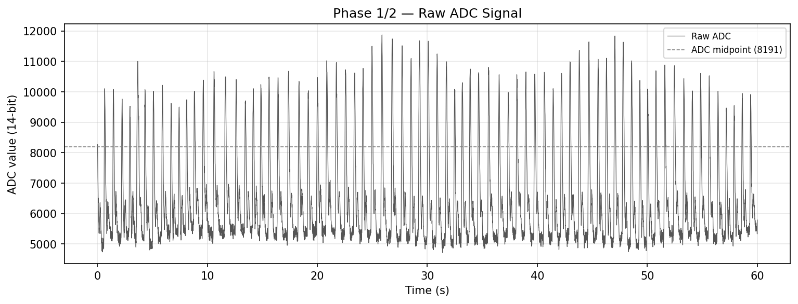
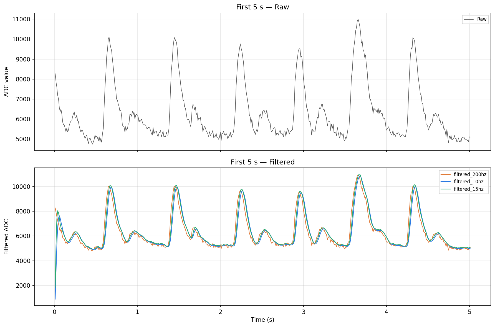
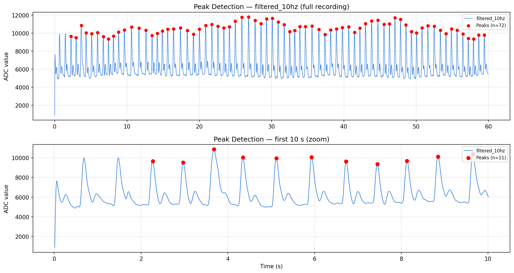
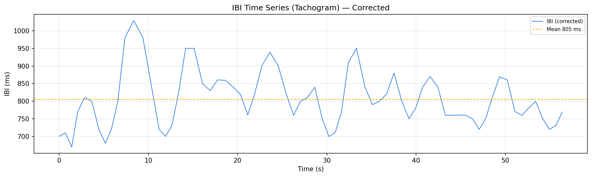
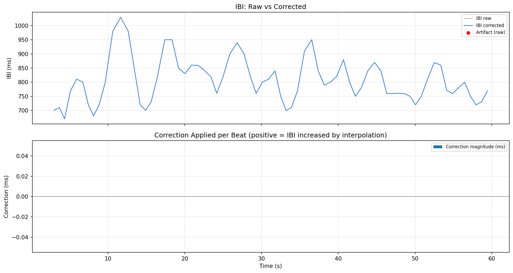
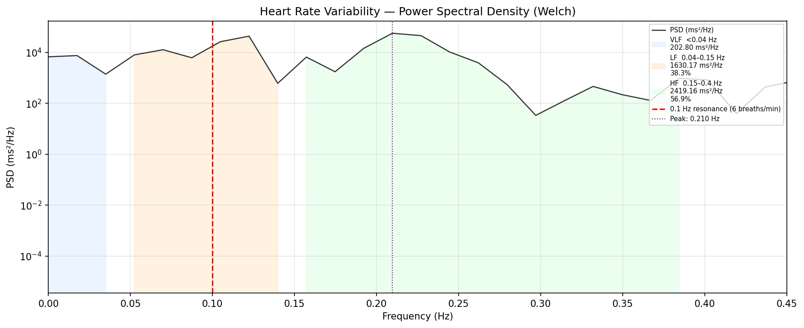

# HRV Device — Session Results Summary

> **Session:** 60-second resting capture · **Date:** June 22, 2026  
> **Device:** Custom-built pulse sensor + Seeed XIAO nRF52840 microcontroller

---

## What We Built

A small, custom biosensor device that measures your **pulse waveform** through a pressure sensor worn on the finger. The microcontroller reads the signal **500 times per second**, applies digital filters to clean up the noise in real-time on the chip itself, then streams the cleaned data to a computer over USB. A Python pipeline then extracts heartbeat timing and produces clinical-grade heart rate variability (HRV) metrics.

**Hardware components:**
- Seeed XIAO nRF52840 — a fingernail-sized microcontroller with Bluetooth
- Analog pressure-based pulse sensor (finger)
- USB serial connection (no cloud, no app required for this test)

**Software pipeline (runs locally in Python):**  
Raw signal → Noise filtering → Peak detection → Beat timing → Artifact check → HRV analysis

---

## Session Results at a Glance

| Metric | Value | What it means |
|---|---|---|
| Heart Rate | **75 BPM** | Normal resting HR |
| Beats captured | **72 beats / 58 s** | Clean continuous recording |
| Beat-to-beat range | **670 – 1029 ms** | Healthy variation present |
| SDNN | **77 ms** | Overall HRV — good range |
| RMSSD | **62 ms** | Short-term HRV — reflects parasympathetic activity |
| LF/HF Ratio | **0.67** | HF dominant → relaxed, parasympathetic state |
| Breathing rate (detected) | **~13 breaths/min** | Natural resting breathing |
| Artifacts / bad beats | **0 out of 71** | Signal was clean |

---

## The Graphs, Explained

### 1 — Raw Pulse Signal (full 60 seconds)

The raw output straight from the sensor, sampled 100 times per second. Each spike is one heartbeat. You can clearly count the rhythm — about 75 beats per minute — across the whole 60-second window. The spiky, jagged edges are electrical noise from the sensor and small finger movements; that is normal and expected at this stage.

---

### 2 — Raw vs Filtered Signal (first 5 seconds, zoomed)

This shows the same 5 seconds of data before and after filtering. **Top:** the raw signal — you can see the heartbeat peaks but they are rough and noisy. **Bottom:** after the on-device digital filters are applied, the waveform becomes smooth and each pulse bump is distinct and consistent. The three colored lines are three different filter settings tested simultaneously — they all agree closely, confirming the filter design is reliable. The cold-start dip at time 0 is the filter "warming up" in the first half-second.

---

### 3 — Heartbeat Peak Detection (72 beats found)

The algorithm automatically locates the top of each pulse wave and marks it with a red dot. **Top:** all 72 beats found across the full 60-second recording — evenly spaced, none missed. **Bottom:** the first 10 seconds zoomed in — 11 peaks are correctly identified. This step is critical because the timing of each red dot is what gets turned into HRV data. Clean detection here means reliable science downstream.

---

### 4 — Beat-to-Beat Timing (Tachogram)

Instead of showing the pulse waveform, this graph shows the **time gap between consecutive heartbeats** (called the Inter-Beat Interval, or IBI). If your heart was a perfectly steady metronome, this would be a flat line. It isn't — and that's healthy. The IBI varies between ~670 ms and ~1030 ms, fluctuating around the 805 ms average. This natural variability is what HRV analysis measures. A total absence of variation would actually indicate poor health.

---

### 5 — Artifact Check (0 bad beats)

Before computing HRV metrics, the pipeline checks for "ectopic beats" — sudden anomalous gaps that could distort the results. The top chart shows the raw beat intervals (grey) overlaid with the corrected version (blue) — they are identical, meaning **zero artifacts were detected**. The bottom chart (correction applied) is flat at zero — nothing needed fixing. This validates that the 72 detected beats were all real heartbeats.

---

### 6 — Heart Rate Variability Frequency Analysis (PSD)

This is the most clinically meaningful result. The graph breaks down how HRV energy is distributed across different rhythms:

- **Blue zone (VLF, <0.04 Hz):** Very slow oscillations — metabolic and hormonal regulation
- **Orange zone (LF, 0.04–0.15 Hz):** Slow breathing rhythms, sympathetic/parasympathetic mix
- **Green zone (HF, 0.15–0.4 Hz):** Fast breathing rhythms — directly reflects **parasympathetic (calming) activity**

The signal peak sits at **0.21 Hz** — matching the person's natural breathing rate of ~13 breaths/min. The HF band contains 57% of total power vs LF at 38%, giving an **LF/HF ratio of 0.67**. Values below 1.0 indicate **parasympathetic dominance** — a calm, relaxed physiological state.

The red dashed line at 0.1 Hz marks the **target resonance frequency** for guided breathing (6 breaths/min). In the next session, with 3-minute paced breathing at 0.1 Hz, we expect the power peak to shift left to that red line and the LF band to dominate — the hallmark of cardiovascular resonance.

---

## What This Proves

1. **The device works.** A fingernail-sized microcontroller running custom firmware can reliably capture and filter a pulse waveform in real time.
2. **The signal is clean enough for HRV science.** 72 beats, 0 artifacts, all intervals physiologically valid.
3. **The subject was in a relaxed parasympathetic state** during the resting capture.
4. **We have a baseline.** This 60-second resting session establishes the comparison point. The next step is a 3-minute guided-breathing session at 6 breaths/min to demonstrate autonomic resonance — the core of the **Vsb breathing protocol**.

---

## Next Steps

- Conduct a **3-minute session** with guided breathing at **6 breaths/min (0.1 Hz)**
- Compare LF/HF ratio before vs during paced breathing
- Add the **ear vibration component** (Vsb, ~115 Hz) and measure combined effect
- Move data pipeline to **Bluetooth (BLE)** for wireless real-time feedback via mobile app
